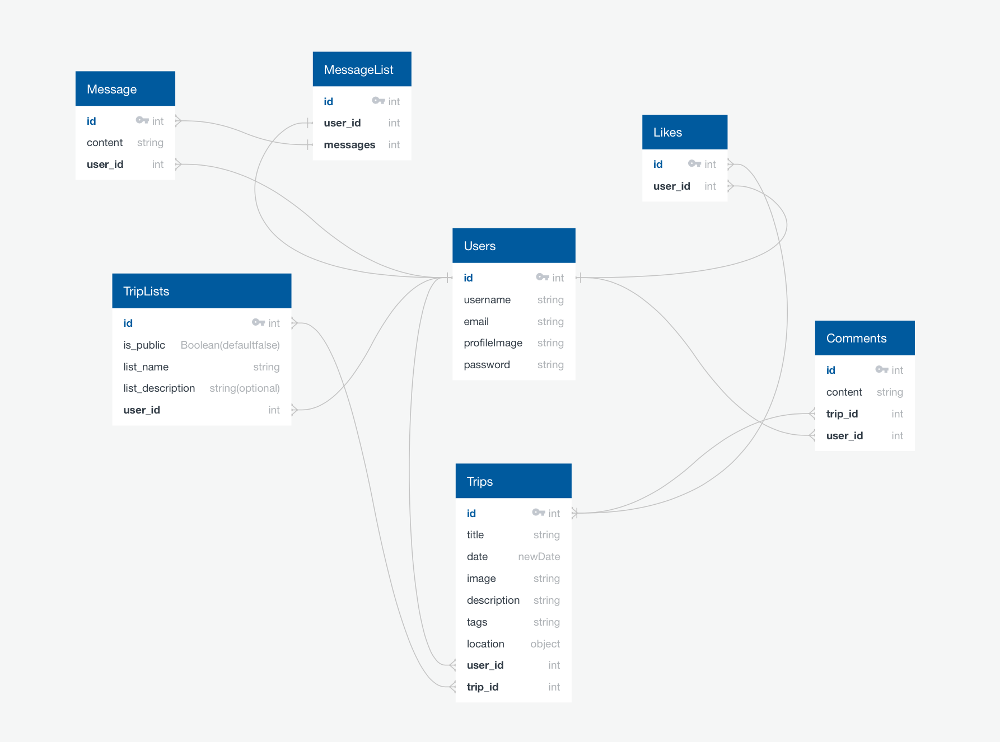
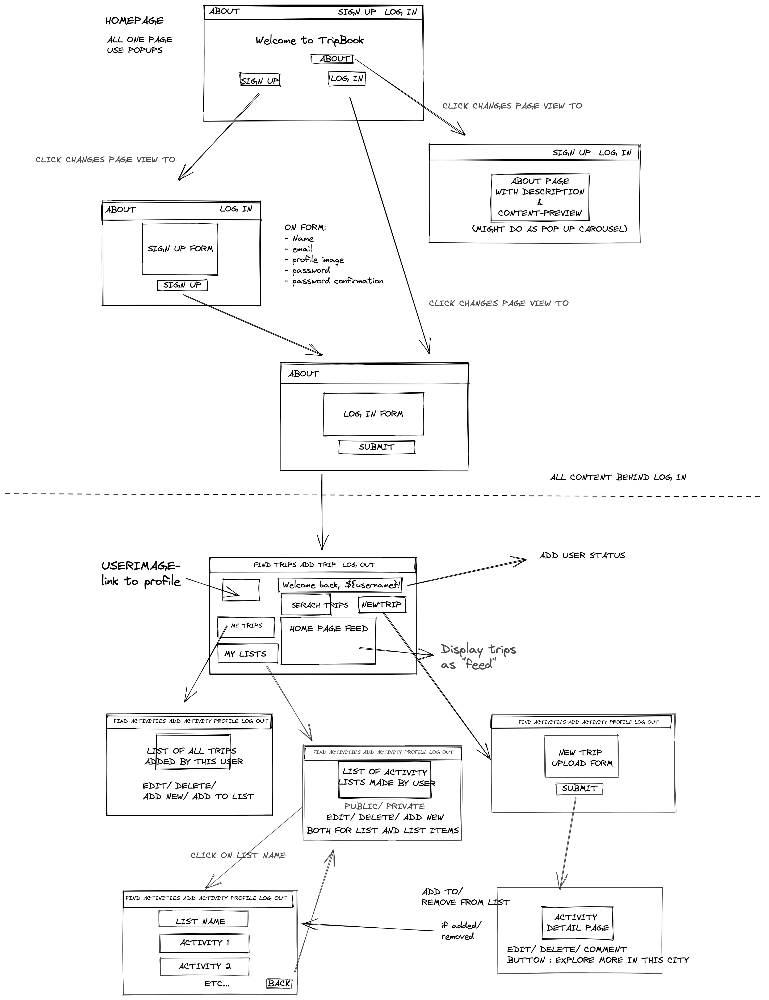

 GENERAL ASSEMBLY — SOFTWARE ENGINEERING IMMERSIVE 2021

# TripBook
## Project 4

A social media network that allows users to create a profile for themselves, share favourite past trips they have been on and create and manage wish lists for future trips. 

[Try it out.](insert link to deployed app)

For the best user experience I would recommend to register with a name and profile photo, to fully see the customization per user across the app. 


## Table of Contents

1. [Brief](https://github.com/khackethal/project-4-client#brief)
2. [Approach](https://github.com/khackethal/project-4-client#brief)
   - [MVP](https://github.com/khackethal/project-4-client#mvp)
   - [Technologies](https://github.com/khackethal/project-4-client#technologies)
   - [Methodologies](https://github.com/khackethal/project-4-client#methodologies)
3. [Planning](https://github.com/khackethal/project-4-client#planning)
   - [Back End](https://github.com/khackethal/project-4-client#back-end)
   - [Front End](https://github.com/khackethal/project-4-client#front-end)
4. [Challenges](https://github.com/khackethal/project-4-client#challenges)
5. [Key Learnings](https://github.com/khackethal/project-4-client#key-learnings)
6. [Conclusions](https://github.com/khackethal/project-4-client#conclusions)

## Brief

Create a full-stack application with its own front end and back end. Use a Python Django API, using a Django REST Framewrok to serve data from a Postgres Database. Consume the API with a React front end.  
Create a complete product with multiple relationships and CRUD functionality. Implement thoughtful user stories and have a visually impressive design. Deploy online so it's publicly accessible.

## Approach

### MVP

My main priority was creating a seamless user experience, allowing a journey through the app that makes sense, and interlinking all related components. The most important elements and main targets were:

- Login and Register functionality, with all content availble after login only as the app experience requires a user profile
- Customization of the Navbar and SideBar for each user, giving them easy and fast access to all trips they posted and all lists they created
- Displaying all trips on a homepage as easily searchable 'feed'
- The ability to easily view other users lists, and add any trips within them to the user's own lists
- Easy travel through the app between trips, lists and other user profiles, with everyting the user would expect to be a link actually being one
- Building the entire React frontend with pure CSS from scratch, not using any libraries or frameworks

A stretch goal I dind't have time to implement was a messaging functionality between users, which I might revisit in the coming weeks.


### Technologies/ Frameworks/ APIs

#### Back End
- PostgreSQL
- Django
- Pylint
- Psycopg2 Binary
- Django
- Django Reast Framework
- Djano Rest Framework Camel Case

#### Front End
- Axios
- Cloudinary
- React
- React Router
- React Map GL
- React Map Gl Geocoder
- React Confirm Alert
- React Loader Spinner
- React Responsive Carousel
- Mapbox
- Moment
- Node.js


### Methodologies
- Write readable, simple, DRY code per KISS
- Create reuseable components that have a clear, specific task 

N. B it was optional to work in groups for this project, I chose to work solo to ensure I have clearly understood all aspects of creating both the Back End and the Front End, and to consolidate existing CSS skills. 


## Planning

I spent a great deal of time in the planning phase, thinking through the backend relationships and the user journey through the app. Below are my initial diagrams for both Back End and Front End, the finished app hardly deviates from them due to the extended planning phase.


### Back End 

### Entity Relationship Diagram

The below diagram was created using [ Quick Db.](https://www.quickdatabasediagrams.com/)




#### The Trip Model:

The most important model is the trip itself, as it unites the relationships between creators, likes, comments and lists.

```
python

class Trip(models.Model):
    location_id = models.CharField(max_length=20, blank=True)
    name = models.CharField(max_length=50)
    latitude_longitude = ArrayField(models.FloatField(max_length=50, blank=True))
    description = models.TextField(max_length=500)
    image = models.CharField(max_length=250)

    liked_by = models.ManyToManyField(
        'jwt_auth.User',
        related_name='likes',
        blank=True
    )

    listed_by = models.ManyToManyField(
        'jwt_auth.User',
        related_name='lists',
        blank=True
    )

    owner = models.ForeignKey(
        'jwt_auth.User',
        related_name='created_trips',
        on_delete=models.CASCADE
    )

    def __str__(self):
        return f'{self.name} in {self.location_string}'
```


The lists themselves have extensive views for the user to interact with, similar to the ones written for the original trips.

```
## VIEW ALL TRIP LISTS
class UserTripListView(APIView):   
    permission_classes = (IsAuthenticated, )
    def get(self, _request):
        lists = UserTripList.objects.all()
        serialized_trips = PopulatedUserTripListSerializer(lists, many=True)
        return Response(serialized_trips.data, status=status.HTTP_200_OK)
    
## POST A NEW LIST
    def post(self, request):
        request.data['owner'] = request.user.id
        new_list = UserTripListSerializer(data=request.data)
        if new_list.is_valid():
            new_list.save()
            return Response(new_list.data, status=status.HTTP_201_CREATED)
        return Response(new_list.errors, status=status.HTTP_422_UNPROCESSABLE_ENTITY)


## VIEW A SINGLE LIST and METHODS
class UserTripListDetailView(APIView):
    permission_classes = (IsAuthenticated, )
#FIND MATCH
    def get_list(self, pk):
        try:
            return UserTripList.objects.get(pk=pk)
        except UserTripList.DoesNotExist:
            raise NotFound()
# SHOW ONE
    def get(self, _request, pk):
        user_list = self.get_list(pk=pk)
        serialized_list = PopulatedUserTripListSerializer(user_list)
        return Response(serialized_list.data, status=status.HTTP_200_OK)

# DELETE LIST
    def delete(self, request, pk):
        list_to_delete = self.get_list(pk=pk)
        if list_to_delete.owner != request.user:
            raise PermissionDenied()
        list_to_delete.delete()
        return Response(status=status.HTTP_204_NO_CONTENT)

## RENAME LIST OR CHANGE PRIVACY SETTINGS 
    def put(self, request, pk):
        list_to_update = self.get_list(pk=pk)
        if list_to_update.owner != request.user:
            raise PermissionDenied()
        request.data['owner'] = request.user.id
        updated_list = UpdatedUserTripListSeralizer(list_to_update, data=request.data)
        if updated_list.is_valid():
            updated_list.save()
            return Response(updated_list.data, status=status.HTTP_202_ACCEPTED)
        return Response(updated_list.errors, status=status.HTTP_422_UNPROCESSABLE_ENTITY)
```

Another noteworthy feature of the backend is the tweaked the login return, which returns the user id, enabling me to write a simple Front End React Hook for every component to use to identify the current user and update the component render immediatly on user changes (detailed in FrontEnd section).

```

class LoginView(APIView):

    def post(self, request):
        email = request.data.get('email')
        password = request.data.get('password')

        try:
            user_to_login = User.objects.get(email=email)
        except User.DoesNotExist:
            raise PermissionDenied({'detail': 'Unauthorized'})

        if not user_to_login.check_password(password):
            raise PermissionDenied({'detail': 'Unauthorized'})

        expiry_time = datetime.now() + timedelta(days=7)
        token = jwt.encode(
            {'sub': user_to_login.id, 'exp':  int(expiry_time.strftime('%s'))},
            settings.SECRET_KEY,
            algorithm='HS256'
        )
        return Response(
            {'token': token, 'userId': user_to_login.id ,'message': f'Welcome back {user_to_login.username}'}
        )
```

### Front End

The front end is a React app, using the following wireframes. 
The below frames have been tweajed slighlty for the final app, as I felt it would be neneficial for the user and create a more seamless experience to reduce the number of pages and page changes.
The below wireframes were created using [ Excalidraw. ](https://excalidraw.com/) 

##


##


I meantioned the User Hook above, it enables the app to be highly personialed.

On login, the user id returned by the backend is stored in local storage: 

```
export function setUserId(userId) {
  window.localStorage.setItem('userId', userId)
  console.log(`userId has been set to ${userId}`)
}

export function getUserId(){
  return window.localStorage.getItem('userId')
}

export function removeUserId(){
  window.localStorage.removeItem('userId')
}
```

This user hook using uses the id to set the current user:

```
import React from 'react'
import { getUserId } from '../../lib/auth'
import { userProfileView } from '../../lib/api'

function useSetUser() {

  const userId = getUserId()
  const [user, setUser] = React.useState(null)
  const [error, setIsError] = React.useState(false)

  React.useEffect(() => {
    const getData = async () => {
      try {
        const result = await userProfileView(userId)
        setUser(result.data)
      } catch (e) {
        setIsError(true)
      }
    }
    getData()
  },[userId])

  return {
    user,
    setUser,
    error,
    setIsError,
  }
}

export default useSetUser
```

Every component can then use a single line of code to determine the current user and modify the component contents accordingly.
```
 const { user, setUser } = useSetUser()
```

Exporting setUser as well measn we can instantly re-render the component after the user makes a change, for example updating the status in the status box component, or after uplaoding a new profile image.
This enables customization and responsiveness across the app. The Status Box component is listed as an example use case below.

```
import React from 'react'
import useSetUser from '../hooks/SetUser'
import { useForm } from '../hooks/useForm'
import { editUserProfile } from '../../lib/api'
import Loader from 'react-loader-spinner'
import Error from '../auth/Error'


function StatusBox() {

  const { user, setUser } = useSetUser()
  const userId = user?.id
  const [ statusPlaceholder, setStatusPlaceholder ] = React.useState(null)
  const [error, setIsError] = React. useState(false)

  const { formData, handleChange } = useForm({
    status: '',

  })
  
  const handleStatusSubmit = async (e) => {
    e.preventDefault()

    try {
      const res = await editUserProfile(userId, formData)
      console.log('res', res.data)
      setStatusPlaceholder(`What's on your mind, ${user.username}?`)
      setUser( { ...user, status: res.data.status })

    } catch (err) {
      setIsError(true)
    }
  }


  return (
    <>
      { user?.username ? 
        <div >
          
          <p className="status-paragraph">{user?.status}</p> 
          <div className="input-div">
            <input 
              name="status" 
              onChange={handleChange}
              className="status-input" 
              width="100px"
              placeholder= {statusPlaceholder ?  { statusPlaceholder } : `What's on your mind, ${user?.username}?`}></input>
          </div>
          <div className="status-button-div">
            <button onClick={handleStatusSubmit} className="status-button">Submit Status</button>
          </div>
        </div> : 
        <Loader
          type="ThreeDots"
          color="#1877F2"
          height={100}
          width={100}
          timeout={3000} 
        />}
      {error && <Error />}
    </>
  )
}

export default StatusBox
```

The main feature of the app is the ability to create future tip wishlists by adding trips other users have posted. User have the opportunty to set their lists as either "public" (visibile to all other users) or "private"(visible only to them). 


Other than the cusomisation the app follows the typical React patterns of fetching, mapping or fitering and then displaying data. 

### Challenges & Bugs

The main challenge on this project was definitely time, it was an ambitious app to complete in 8 days, especially given that no CSS frameworks were used.
While most bugs were fixed by the end of the project a couple still reamin. 

On the sinlge trip view, the function to filter out user lists that the trip has already been added to currently downs't work, the path breaks with "cannot read property "inlcudes" of undefined". This means curretnly a user list will appear with the option to add even if the trip has already been added. As the function is a toggle function clicking add again will actually remove the trip from the list.
Possible solutions: 
1) Filter the lists before mapping over them, rather than do the map and filter in one go which results in the error. 
2) Change the backend to have one "add" and one "delete" path.

Then secondly, on the edit trip function the map is not zooming into the previous trip location. The information is there in the backend, so if the user does not edit the map it will remain the same, however currently the zoom is missing. 
To solve this temporatily, I've added another map component above the edit function to show the correct current location.


### Key Learnings


### Conclusions & Future Features

Due to time contraints I didn't meet a few of my goals, namely:

1) Messaging between users
2) A more extensive user profile which includes a cover image, and single buttons to edit each section with one click
3) Mobile responsiveness - the page currently works fine viewed on desktop, but starts looking strange for a screen size less than 1100px wide


